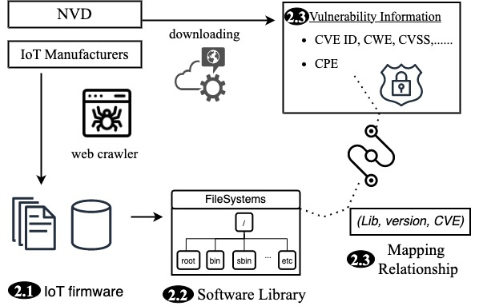

## AutoFirm - Automatic Firmware Analysis

<p align="center">
  
</p>


This repository is an **open-source tool of AutoFirm**, as well as the artifacts of our paper "AutoFirm: Automatically Identifying Reused Libraries inside IoT Firmware at Large-Scale". 

The repository is organized as follows:
```
AutoFirm/
│ ├── README.md
│ ├── tool/
|   ├── main.py 
|   ├── scan.py
|   ├── path_search.py
|   ├── linux_shell.py
|   ├── common.py
|   ├── bin_analysis.py
|   ├── bin_process.py
|   ├── decompress.py
|   ├── filesystem.py
|   ├── regex/
│   │ ├── arch.json
│   │ ├── black_list.csv
│   │ ├── special_command.csv
│   │ ├── special_regex.csv
│   │ └── special_ver.csv
└── artifact/
  ├── firmware/
  └── library/
  └── vulnearbility/
  └── RQ/
```


The `Autofirm/` folder is organized such that the top level directories are different splits of bench (tool, artifact).

The `tool/` folder contains the source code of AutoFirm, which automatically downloading, decompressing firmware, and identifying libraries and versions, and detecting vulnearable versions.
The `tool/regex` is a folder that contains the regex rules for identifying the firmware architecture, black list, special command, special regex, and special version.
The `artifact/` folder contains dataset of firmware, library, vulnearbility, and research questions for our paper. 

### Usage

1. iterate vendor
2. read vendor.json to get info (the conjunction of firmware real name and local storage name)
3. use binwalk to extract filesystem
4. judge if the step 3 succeed 
5. iterate the successfully extracted filesystem
6. search the /bin and /sbin directory and get executable binary
7. use linux file command to get the firmware architecture
8. iterate binary of step 6
9. use qemu to emulate and get version info
10. write to excel named by vendor

### Artifacts


## Usage

Malicious samples are available under the **[samples/](samples/)** folder and compressed as an encrypted ZIP file with the password `infected`. The date indicated as part of the file name is the 
discovery date, not necessarily the package publication date.

You can use the script [extract.sh](./samples/pypi/extract.sh) to automatically extract all the samples to perform local analysis on them. Alternatively, you can extract a single sample using:


## License

This dataset is released under the Apache-2.0 license. You're welcome to use it with attribution.


## FAQ

### Are you maintaining this dataset?

We will be regularly maintaining new packages to the dataset.

### How do you know these vulnerable version are correct?

Every vulnerable library version should be matched with CVE ID.
Every vulnerable library version has been manually triaged by a human.


### Do you accept contributions? 

At the time, the repository is not accepting contributions. 

